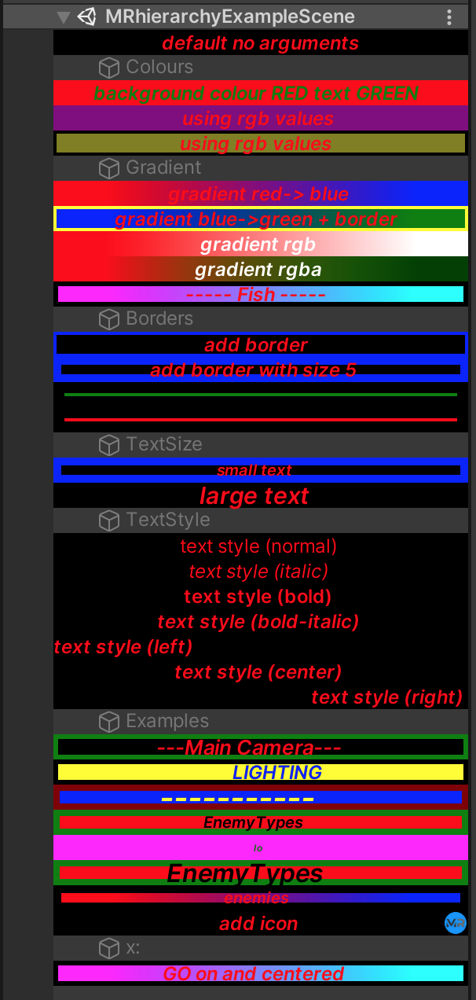

# MRhierarchy

**MRhierarchy.cs** allows us to colourize and customize the look of GameObjects in the Hierarchy.
This may be useful for organizing various parts of the hierarchy more clearly.
For example, we can add a background colour, border colour (and size), text colour (and size).

To activate this use **//** (i.e. double slash; same as creating a comment in your C# script) at the beginning of the GameObject's name. Then you may name it, or leave the name blank.

By default the *MRhierarchy* object is disabled and moved to location (-10000, -10000, -10000). This can be turned off with the **x:** keyword (see below).

`//Coloured Default`

Default colours are *black* background with *red* text and no border.

## The following options are available:

+ bg:   => background colour
+ b:    => border colour
+ bs:   => border size
+ t:    => text colour
+ ts:   => text size
+ tf:   => text format
+ gr:   => gradient with two colours separated by **-** (e.g. red-blue)
+ icon: icn: ic:    => draw MRicon
+ x:    => turn gameObject on and center in scene

using **b:=** results in the border being the same colour as the background (i.e. no border)
All UnityEngine.Color predefined colours are allowed to be used:

* yellow
* clear
* grey
* gray
* magenta
* cyan
* red
* black
* white
* blue
* green

For example:

`//EnemyTypes bg:red b:green bs:4 t:black ts: 16`

`//Terrain gr:yellow-green `

`//----- Fish ----- gr:magenta-cyan b:black bs:3`

Instead of using a colour-name (i.e. *red*), adding the keyword **rgb:** or **rgba:** followed by floating point numbers (0. - 1.) describing your values will also create a colour for you:

`//Custom Colours bg:rgb:0.75,0,0.75 b:=`

Note that the colour values must be separated by a comma **,** and no spaces should be left.

Gradients can also be formatted using the **rgb:** and **rgba:** keywords:

`//Gradients gr:rgb:0,1,0-rgb:1,0,0`

`//Gradients with alpha gr:rgb:0,1,0-rgba:1,0,0,0.5`

Basic text formatting can be done with the **tf:** keyword:

+ n     => normal text
+ i     => italic
+ b     => bold
+ ib    => italic and bold
+ bi    => italic and bold
+ l     => justify left
+ c     => justify center
+ r     => justify right

`//text style (left) tf:l`

`//text style (right) tf:r`

`//text style (left + bold) tf:l,b`

`//text style (center + bold + italic) tf:l,bi`

Note that the formatting values must be separated by a comma **,** and no spaces should be left.

